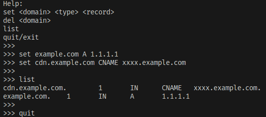

# tmp-resolver

该程序作为一个 dns server 运行，可以在交互式控制台设置给定域名期望的 A记录、CNAME记录，对于未设置的域名，将递归解析并返回结果。

可以方便的应用于本地临时修改dns解析结果的场景，比如
* 切换cdn、负载均衡服务时，本地先临时解析到新的 A、CNAME记录进行测试


---
This program run as a DNS server. You can set resolve result for a given domain. 

It can used for:
* before swith cdn/slb service, test new endpoint locally


## Screenshoot




## Quick Start

build and dns server with interactive console
``` bash
go build .
sudo ./tmp-resolver
```

如果要使用53端口，则需要以root权限运行。

Root privilege required if listen on 53 port.

optional params
|params|detail|example|
|-|-|-|
|--listen|listen on ip and port|:53 / 127.0.0.1:53|
|--upstream|upstream dns ip+port(udp)|8.8.8.8:53|

## storage

Current storage is leveldb, a local file based key-value database.

When run this program, db is created at `./zone.db`
